# pizzaoven

* [My Build](https://github.com/NickAger/pizzaoven/tree/master/pizza-oven-images/my%20build)

## Links
* [INTOCAST](http://www.intocast.co.uk/pizza-and-wood-burning-ovens) "We stock thousands of new and reclaimed firebricks, as well as cements and ceramic fibre blankets. We also stock a number of refractory castables including insulation castables.  Please see our product range. No order is too small. "
* [UK Wood-Fired Oven Forum](http://ukwoodfiredovenforum.proboards.com)
* [Kiln linings - word burning oven kits ](http://kilnlinings.co.uk/wood-burning-oven-kits)
* [Instructables](http://www.instructables.com/id/Wood-Fired-Clay-Pizza-Oven/?ALLSTEPS)
* [Instructables 2](http://www.instructables.com/id/Wood-Fired-Brick-Pizza-Oven-Build/?ALLSTEPS)
* [Instructables index](http://www.instructables.com/howto/pizza+oven/)
* [Forno Bravo community](http://www.fornobravo.com/community/)
* [Vitcas](http://shop.vitcas.com/wood-fired-ovens-13-c.asp?gclid=CjwKEAjw8bO3BRDp0bP_vL-7_lASJACL_d6wbtamUtjwQuEWVlBePiHBUM4MF_emAF4gc5Wr5-PMqxoC56Xw_wcB)

## Fire-bricks

From [fornobravo - the right firebrick](https://www.fornobravo.com/pompeii-oven/brick-primer/) 

> Medium duty firebrick. This is the brick that we recommend for both the cooking floor and dome of the Pompeii oven. medium duty firebricks are comprised of roughly 35% alumina and 50% silica, heat up quickly, easily withstand the 900F heat your oven will reach, and are designed for the rapid heat-up and cool down (thermal cycling) that your oven will experience. Firebrick will also reach the heat required for pizza more quickly than clay brick, as they are more efficient at conducting heat.

* [Kiln linings firebricks](https://www.kilnlinings.co.uk/categories/firebricks)

## Floor insulation

From [fornobravo](https://www.fornobravo.com/product-series/giardino-series-pizza-ovens/):

> Ultra-premium insulation, both in quality and thickness, for outstanding heat retention. Each pizza oven includes a minimum of 3” of high-tech ceramic blanket dome insulation and 2” of ceramic board floor insulation — eliminating the need for old-fashioned and inefficient vermiculite or Perlite-based insulating concrete

and [https://www.fornobravo.com/pizza-oven-insulation/insulation-board/](https://www.fornobravo.com/pizza-oven-insulation/insulation-board/):

> Insulation board is ideal for use as an insulator underneath your pizza oven and brick oven. It is a high strength, high-efficiency Alumina Silicate board originally designed for industrial applications, such as aluminum melting and holding furnaces. One 2″ (5 cm) thick layer of FB Board panel reduces the 800ºF (427 celsius)  cooking floor of a pizza oven to roughly 170ºF (77 celsius) at equilibrium, making it roughly twice as efficient as pure Vermiculite board, and even more efficient than castable Vermiculite and Portland cement mixes.

## Making the dome water-proof

* https://www.thestonebakeovencompany.co.uk/wp/wp-content/uploads/Primo-Render-March-2016-V2.1.1.pdf

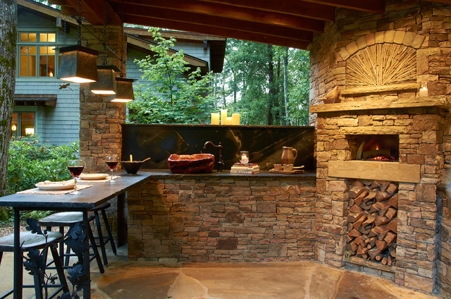
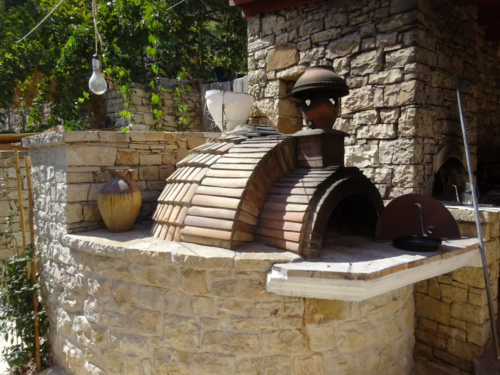
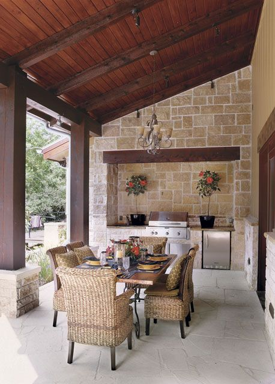
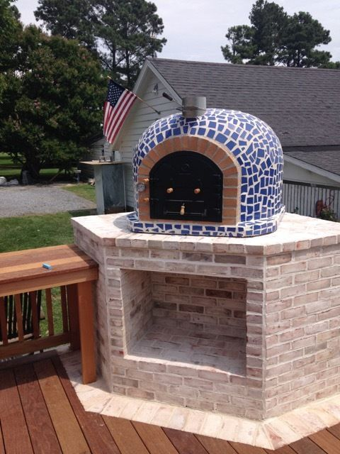
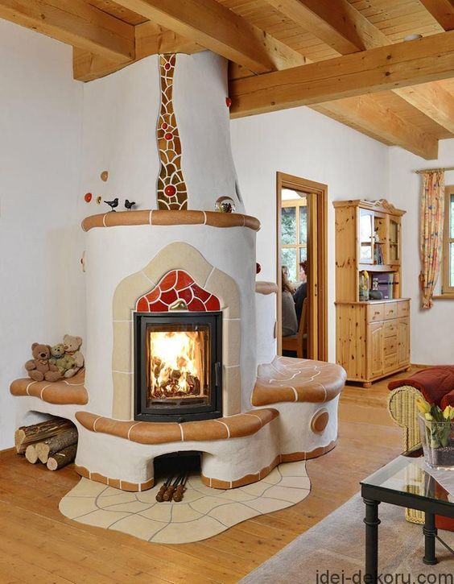
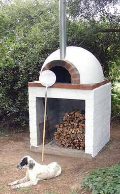

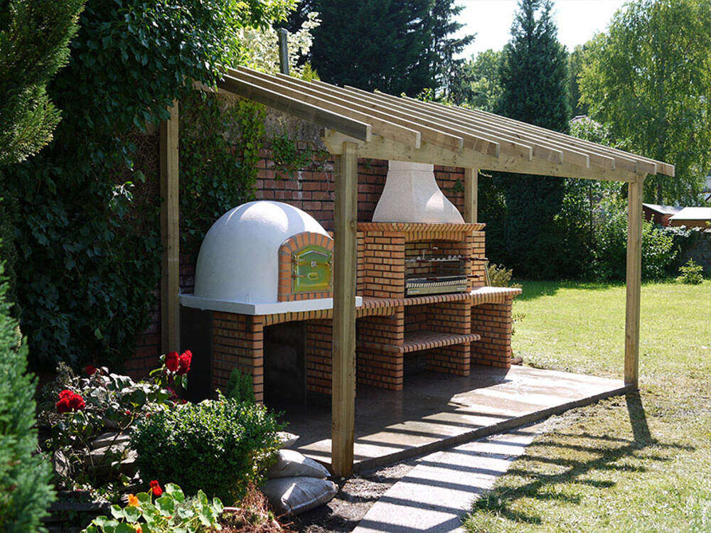
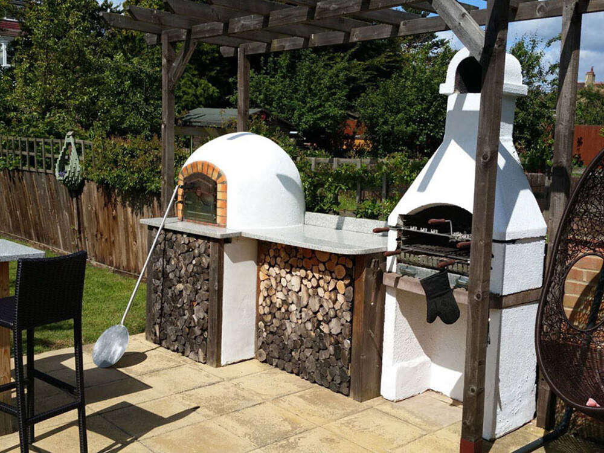

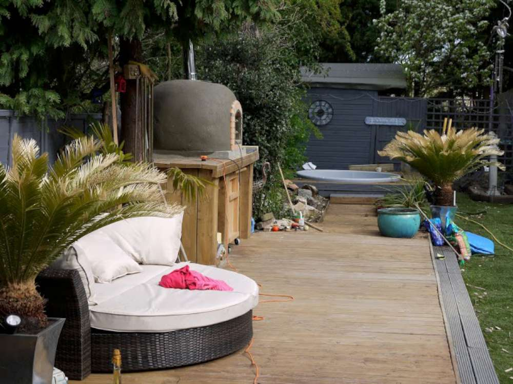
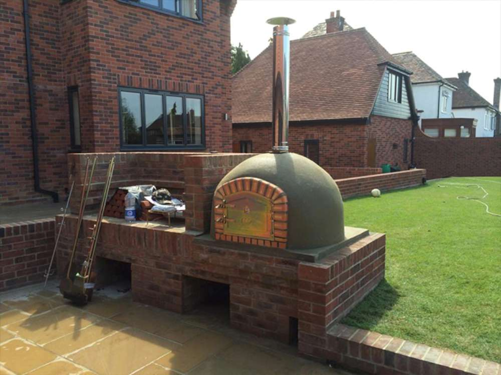

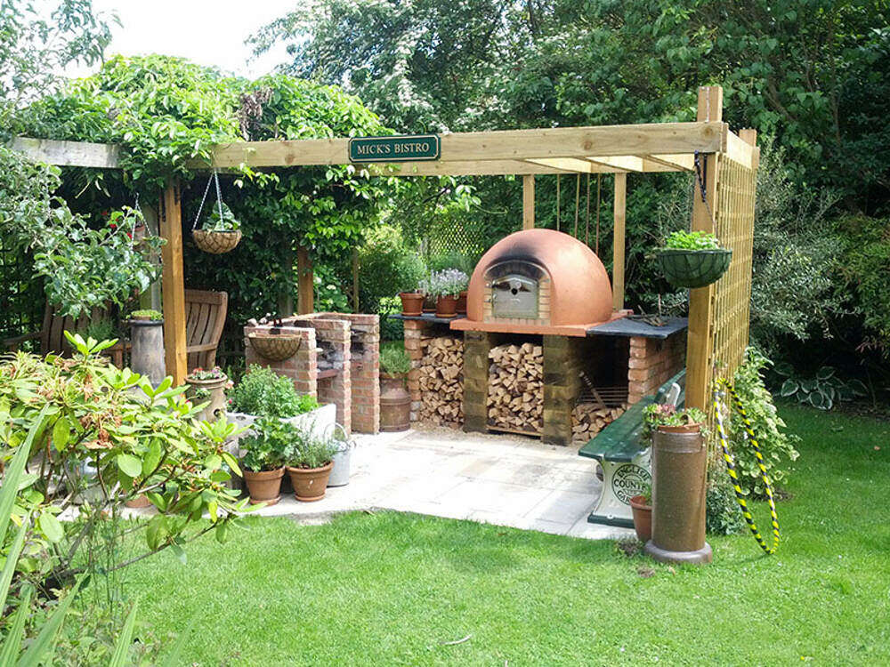
